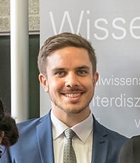

# About

Hi! 

I am a researcher in AI, currently employed as a PostDoc at the [University of Augsburg](https://www.uni-augsburg.de/en/fakultaet/fai/isse/research/artificial-intelligence/).

Coming from a software engineering background (I spent much time programming in Java and Python, drawing UML diagrams, devising user stories, etc.), I decided to share some examples/code etc. that I would have found helpful during my transition towards deep learning. That's why I want to help *connecting the dots*. I have been teaching university classes on machine learning, combinatorial optimization, and self-organizing systems since 2013.

I am convinced that algorithms are taught most efficiently (time invested vs concepts understood) *by example*. Let's work through what is actually computed. Then, dense mathematical notation becomes *much easier* to digest.

In the past, I also had fun writing models for combinatorial optimization problems (think timetabling or scheduling under hard and soft constraints) in [MiniZinc](http://www.minizinc.org) and [MiniBrass](http://minibrass.isse.de).

Cheers,
Alexander Schiendorfer